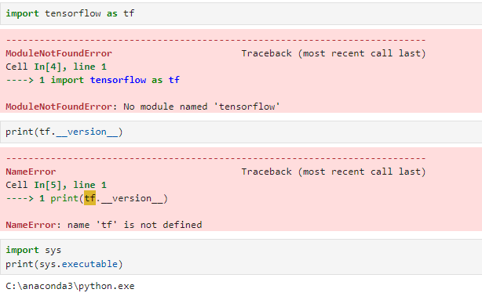
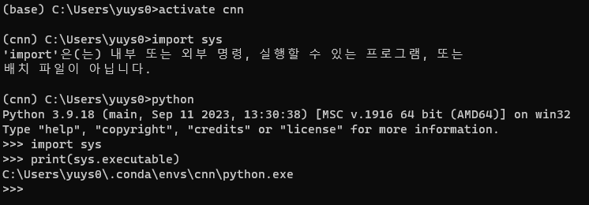
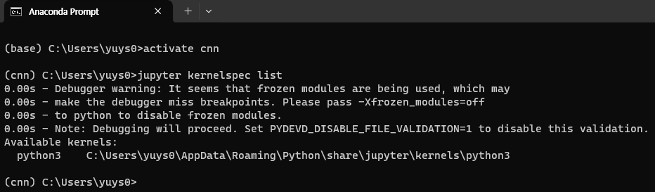
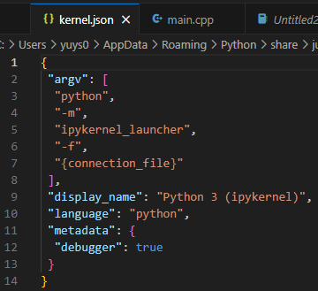
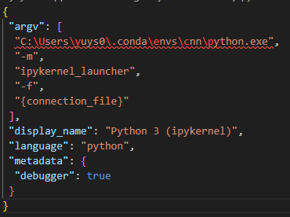
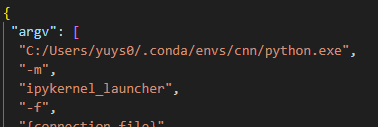
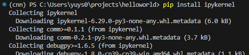
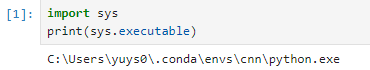
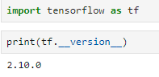

# No module named 'tensorflow'

name 'tf' is not defined

환경 세팅시 Python 버전 호환 이슈가 있을 수 있습니다. 

현재는 파이썬 3.9버전까지 호환이 가능한듯 합니다.

Jupyter notebook에서 Tensorflow import 상황에서 No module named 'tensorflow

라는 오류가 발생할 수 있습니다. 

위의 주소로 들어가면 Kernel이 있는데 이 파일을 여시면 됩니다.

"Python" 에 해당하는 부분에 위에 확인했던 주소를 붙여넣습니다.

C:\Users\yuys0\.conda\envs\cnn\python.exe

저장 후 다시 돌아가서 가상환경에서 pip install ipykernel을 진행해줍니다.

